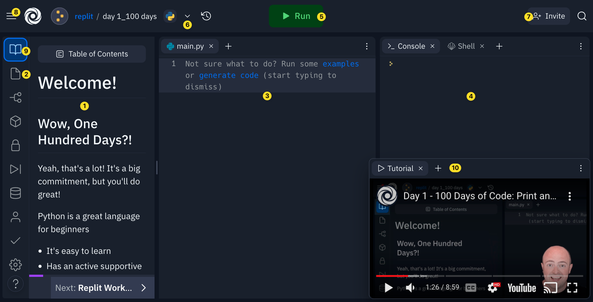

# Replit Workspace
- Click on the `main.py` file on the left. It should open up the file in the main coding window (#2 below) so we can get started.

Let's take a quick tour of the Replit workspace:
  
1. **Tutorial:** this is accesible from the 📖 (9)  icon. You will find video transcript and helper code here.
2. **Files:** if you need to view a different file, just click on it here. This is also where you can upload any assets (pictures, gifs, etc.) to use in your project.
3. **Coding window:** where you will do most of your typing, all your code will be added here, you can also view files here
4. **Console:** shows you the *output* of the program (anything we tell our program to show to our users will appear here)
5. **Run:** will make your code… well, run
6. **Publish:** share your code with our community for others to see and remix
7. **Invite:** allow someone else to edit your code live in multiplayer 
8. **Hamburger:** go back to the main menu
9. This button brings up the tutorial pane if you've closed it
10. Your video tutorial, play through and pause when asked to build up your coding skills!
