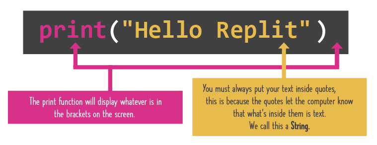

# Our first statement

## Print Statements
You just learned your first command: the `print` statement. It says "Print out whatever's in my brackets".
The `print` statement is how you get your program to put messages in the console.





- The `""` (quotes) are used to tell the command that you're putting *text* in there (any text you want)
- A bunch of text (or whatever you put in quotes) is called a string.


## Multiple Print Statements


👉 Here is what muliple `print` statements looks like. Copy this code into `main.py` and hit `run`.

```python
print("Well we")
print("just use more lines")
print("of code")
```

&nbsp;

👉 Use the ***triple quote*** `"""` if you want to write a big chunk of text with gaps or line breaks. Add this code to what you have in `main.py` and hit `run`.

```python
print("""Anything that starts
with three quotes, and ends
in three quotes can span
many lines and even contain " symbols
within it without freaking anything out!""")
```

### You are on your way to being a coder in no time!
